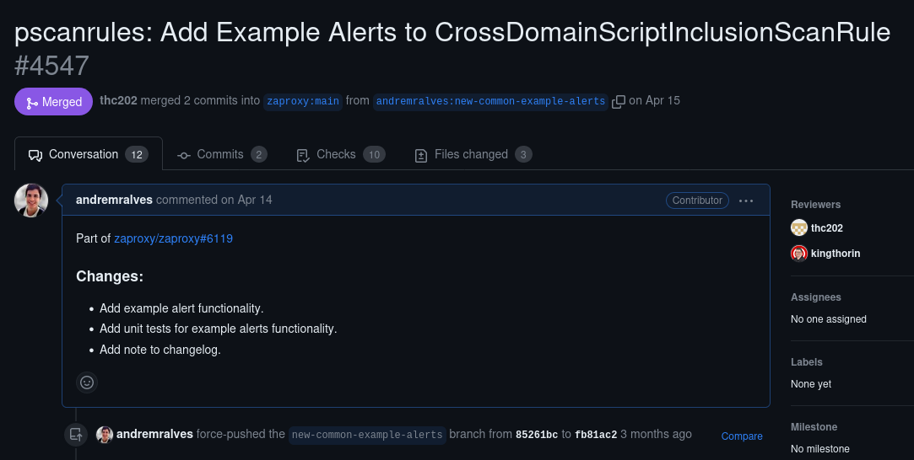

# Projeto: ZAP 

## Contribuição 1

### Issue: [#6119 New common getExampleAlerts() method](https://github.com/zaproxy/zaproxy/issues/6119)

### Pull Request: [#4547 pscanrules: Add Example Alerts to CrossDomainScriptInclusionScanRule](https://github.com/zaproxy/zap-extensions/pull/4547)

## Descrição da Issue

**Resumo:** O mantenedor do projeto está propondo um novo método a ser implementado em todas as classes de scanner, chamado "getExampleAlerts()". Esse método tem o objetivo de fornecer um alerta de exemplo para ser acessado por um script que irá gerar as páginas de alerta na documentação ([https://www.zaproxy.org/docs/alerts/](https://www.zaproxy.org/docs/alerts/)).

