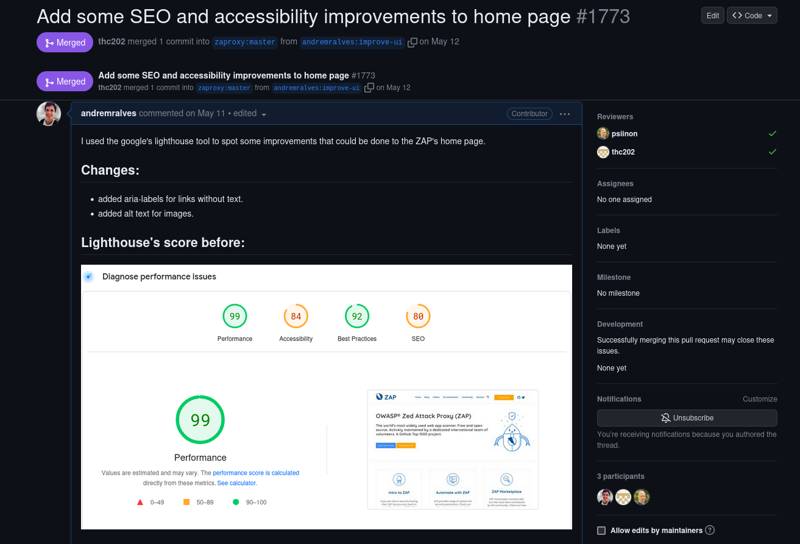
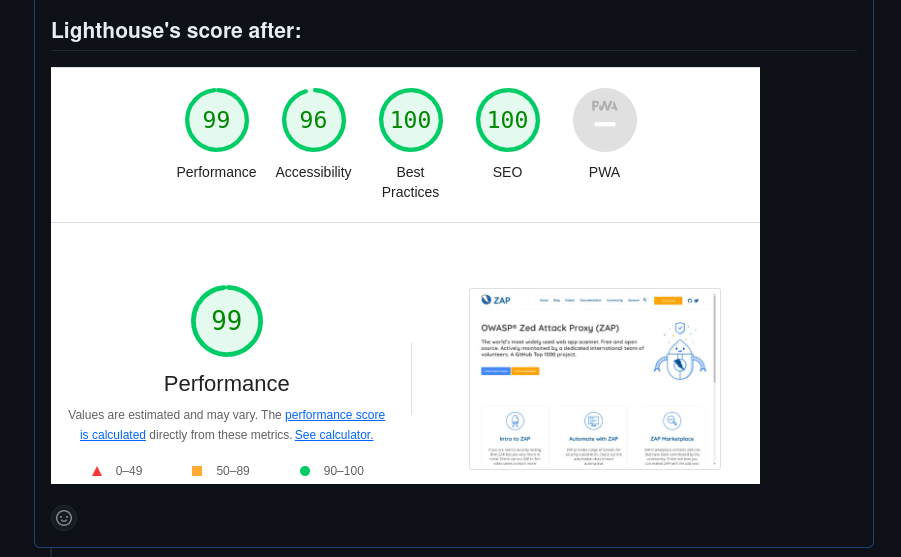
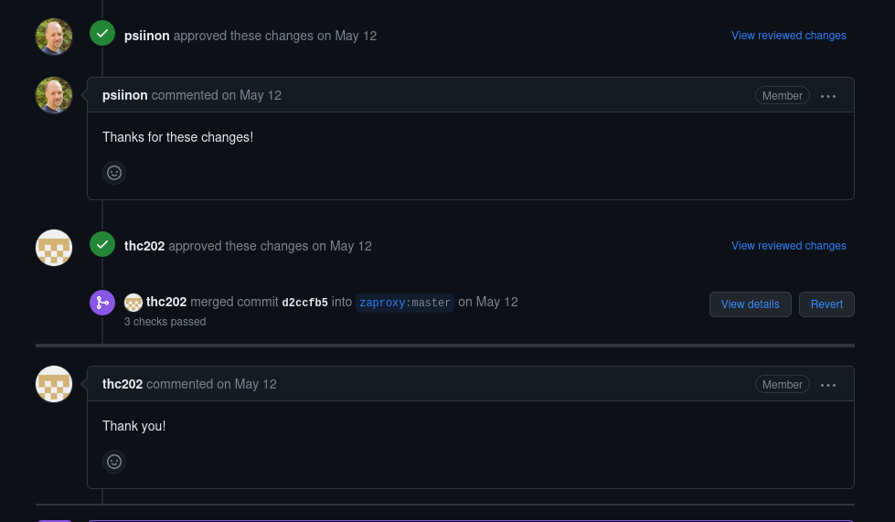

# Projeto: ZAP (zaproxy-website)

### Pull Request: [#1773 Add some SEO and accessibility improvements to home page](https://github.com/zaproxy/zaproxy-website/pull/1773)

**Resumo:** Na sprint 2, eu descobri, utilizando a ferramenta Lighthouse, que o site oficial do ZAP poderia receber algumas melhorias para aumentar o seu score nos pontos de Acessibilidade e SEO. Essas mudanças incluem a adição de atributos alt às imagens e aria-labels para links sem texto.

Com essas alterações, a acessibilidade melhorou de 84 para 96 pontos e o SEO de 80 para 100 pontos.

### Imagem do PR enviado

