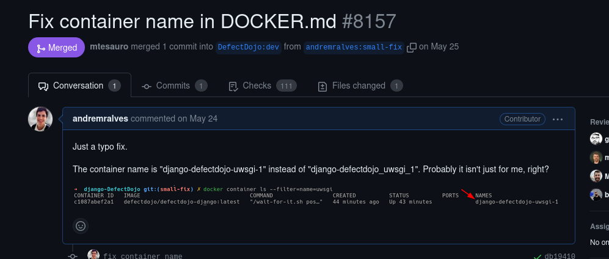
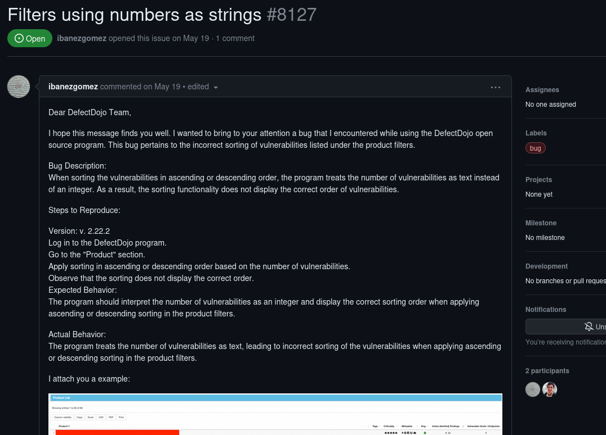
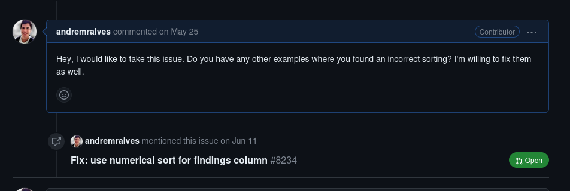
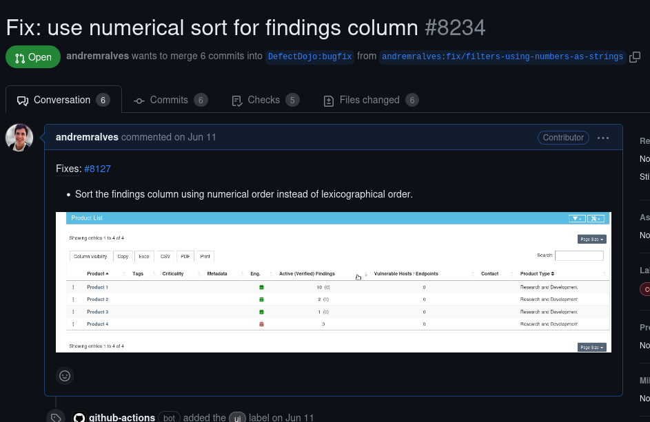

# Projeto: Defect Dojo

## Contribuição 1

### Pull Request: [#8157 Fix container name in DOCKER.md](https://github.com/DefectDojo/django-DefectDojo/pull/8157)

**Resumo:** Apenas uma correção no DOCKER.md que eu encontrei enquanto configurava o projeto.

<figure markdown>

<figcaption>Imagem 1: Pull Request aprovado e mergeado</figcaption>
</figure>

## Contribuição 2
### Issue: [#8127 Filters using numbers as strings](https://github.com/DefectDojo/django-DefectDojo/issues/8127)

### Pull Request: [#8234 Fix: use numerical sort for findings column](https://github.com/DefectDojo/django-DefectDojo/pull/8234)

**Resumo:** Um usuário reportou que na tabela "Product List" a coluna "Active Findings" não estava sendo ordenada corretamente pelo número de cada célula, mas sim pelo valor lexicográfico da string.

<figure markdown>

<figcaption>Imagem 2: Descrição da issue</figcaption>
</figure>

<figure markdown>

<figcaption>Imagem 3: Minha resposta dizendo que vou trabalhar nessa issue</figcaption>
</figure>

<figure markdown>

<figcaption>Imagem 4: Pull Request enviado corrigindo o Bug</figcaption>
</figure>
