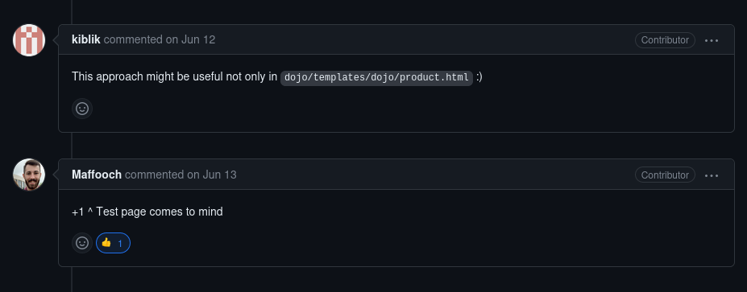
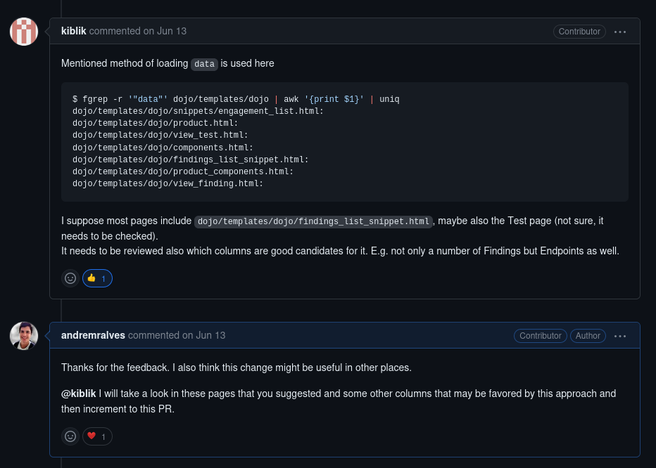

# Projeto: Defect Dojo

## Contribuição 1
### Issue: [#8127 Filters using numbers as strings](https://github.com/DefectDojo/django-DefectDojo/issues/8127)

### Pull Request: [#8234 Fix: use numerical sort for findings column](https://github.com/DefectDojo/django-DefectDojo/pull/8234)

**Resumo:** Após ter finalizado a entrega da sprint passada solucionado o problema na tabela "Product List", um dos mantenedores comentou que essa solução seria util para várias outras tabelas que também estavam com problemas na ordenação. Então, ele me passou uma lista de 7 arquivos html que apresentam tabelas e possivelmente apresentam o mesmo problema de ordenação.

<figure markdown>

<figcaption>Imagem 1: Dois mantenedores comentam que essa solução seria util em outras páginas</figcaption>
</figure>

<figure markdown>

<figcaption>Imagem 2: Lista dos arquivos a serem checados e minha resposta aceitando o desafio.</figcaption>
</figure>
