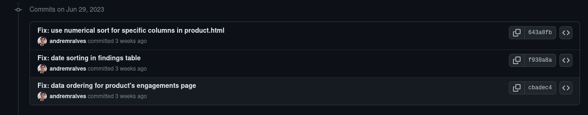

# Projeto: Defect Dojo

## Contribuição 1
### Issue: [#8127 Filters using numbers as strings](https://github.com/DefectDojo/django-DefectDojo/issues/8127)

### Pull Request: [#8234 Fix: use numerical sort for findings column](https://github.com/DefectDojo/django-DefectDojo/pull/8234)

**Resumo:** Nessa sprint, continuei trabalhando no desafio que foi me passado na sprint passada de consertar a ordenação de todas as tabelas da aplicação. Até então, consegui realizar metade do trabalho.

<figure markdown>

<figcaption>Imagem 1: Meu progresso até o momento</figcaption>
</figure>

## Extra

Comecei a estudar um novo projeto dentro da organização OWASP chamado [Coraza](https://coraza.io/), um WAF (Web Application Firewall) construído em Go com o objetivo de se tornar o substituto do Mod Security (um outro WAF que estará deixando de ser mantido).