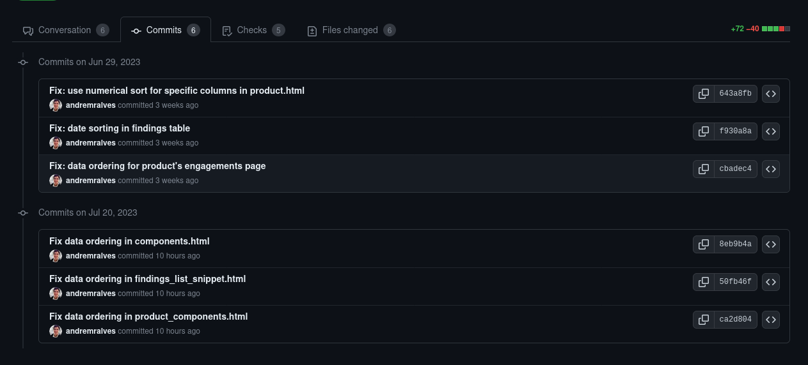
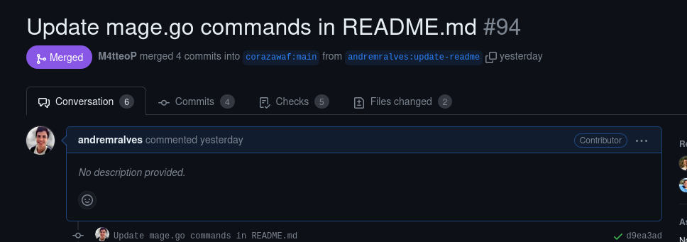
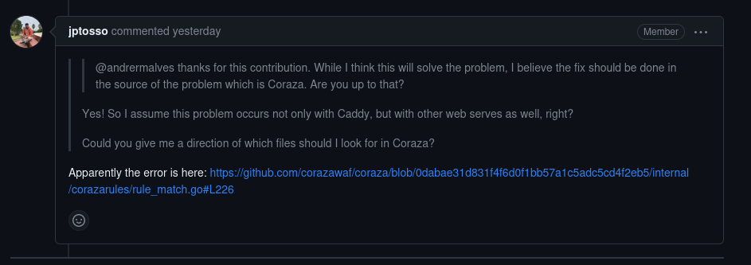

# Projetos: Defect Dojo e Coraza

## Contribuição 1
### Issue: [#8127 Filters using numbers as strings](https://github.com/DefectDojo/django-DefectDojo/issues/8127)

### Pull Request: [#8234 Fix: use numerical sort for findings column](https://github.com/DefectDojo/django-DefectDojo/pull/8234)

**Resumo:** Nessa sprint, eu finalizei minha contribuição para a issue #8127, verificando e consertando a ordenação das tabelas de todas as páginas apontadas. Por fim, foram 6 commits, um para cada página e para a sétima página não foi necessário realizar alterações. Agora só estou aguardando a revisão e aprovação dos mantenedores.

<figure markdown>

<figcaption>Imagem 1: Meu comentário ao terminar as tarefas.</figcaption>
</figure>

<figure markdown>

<figcaption>Imagem 2: Todos os commits que foram feitos.</figcaption>
</figure>

<figure markdown>

<figcaption>Imagem 3: Conflitos resolvidos com um rebase.</figcaption>
</figure>

## Contribuição 2

### Pull Request: [#94 Update mage.go commands in README.md](https://github.com/corazawaf/coraza-caddy/pull/94)

**Resumo:** Corrigi uma listagem de commandos que estava desatualizada no README e a descrição de algumas funções no arquivo magefile.go.

<figure markdown>

<figcaption>Imagem 4: PR enviado.</figcaption>
</figure>

<figure markdown>

<figcaption>Imagem 5: Considerações do mantenedor.</figcaption>
</figure>

<figure markdown>

<figcaption>Imagem 6: Mais algumas correções e PR mergeado.</figcaption>
</figure>

## Contribuição 3

### Issue: [#87 Double break line when writing error logs](https://github.com/corazawaf/coraza-caddy/issues/87)

### Pull Request: [#93 Fix double line break for erros in console output](https://github.com/corazawaf/coraza-caddy/pull/93)

**Resumo:** Essa issue é está relacionada com o systema de logs do Coraza que está printando duas quebras de linhas em algumas situações, como por exemplo: Ao usar o Coraza com o web server Caddy. Ela foi reportada inicialmente no repositório coraza-caddy. Eu consegui resolver o problem na integração com o Caddy, porém os mantenedores falaram que esse era um problema que vinha lá do próprio coraza e seria melhor resolver lá direto.

<figure markdown>

<figcaption>Imagem 7: Descrição da issue e minha mensagem aceitando resolvê-la.</figcaption>
</figure>

<figure markdown>

<figcaption>Imagem 8: Meu Pull request resolvendo o problema para o coraza-caddy.</figcaption>
</figure>

<figure markdown>

<figcaption>Imagem 9: .</figcaption>
</figure>

<figure markdown>

<figcaption>Imagem 9: .</figcaption>
</figure>