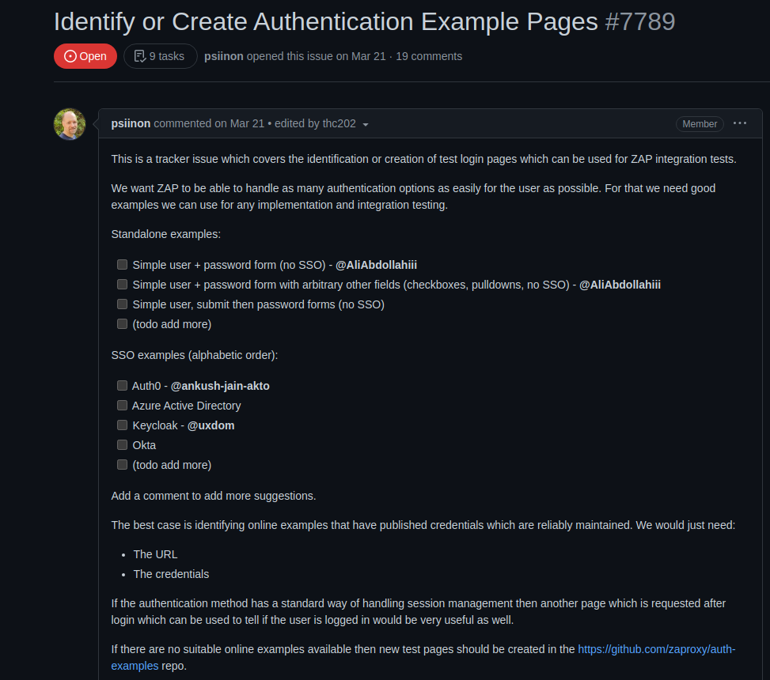

## Projeto: ZAP 

### Issue: [#7789 Identify or Create Authentication Example Pages ](https://github.com/zaproxy/zaproxy/issues/7789)

## Descrição da Issue
Este é uma issue do rastreador que abrange a identificação ou criação de páginas de login de teste que podem ser usadas para testes de integração do ZAP.

Os mantenedores do ZAP querem que ele seja capaz de lidar com o maior número possível de opções de autenticação para o usuário da forma mais fácil possível. Para isso, eles precisam de bons exemplos que possamos usar para qualquer teste de implementação e integração.

Ele adicionou uma série de exemplos de páginas de autenticação que poderiam ser criados, então, eu e o Thiago Gomes, também do meu grupo, decidimos parear uma dessas opções, no caso, a terceira da lista, onde deveria ser enviado um formulário de email, e depois ser enviado para um formulário de senha, mais ou menos como funciona a autenticação do google. Essa sprint foi basicamente para estudo de issue, nós chegamos a desenvolver uma aplicação que ainda não tinha sido finalizada no momento, utilizando express e server side rendering com a lib handlebars.