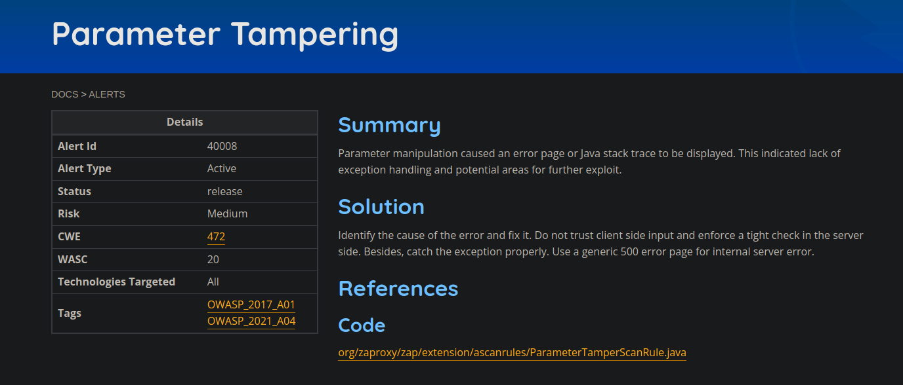

## Projeto: ZAP 

### Issue: [#7789 Identify or Create Authentication Example Pages ](https://github.com/zaproxy/zaproxy/issues/7789)

## Descrição da Issue
Este é uma issue do rastreador que abrange a identificação ou criação de páginas de login de teste que podem ser usadas para testes de integração do ZAP.

Os mantenedores do ZAP querem que ele seja capaz de lidar com o maior número possível de opções de autenticação para o usuário da forma mais fácil possível. Para isso, eles precisam de bons exemplos que possamos usar para qualquer teste de implementação e integração.

## O que foi desenvolvido para essa issue?

A aplicação pareada com o Thiago deu certo e desenvolvemos um server side render utilizando express e handlebars, também os dados eram persistidos em um banco sqlite para fins de validação, porém, o mantenedor entrou em uma discussão nas conversas da issue e disse que não precisava de soluções backend no momento, somente front, a nível de tela mesmo, como nossa aplicação era basicamente backend com server side render, decidimos deixar de lado essa issue, que acabou sendo um problema por conta da conversa ter acontecido alguns dias antes da entrega da sprint.

### Issue: [#6119 New common getExampleAlerts() method](https://github.com/zaproxy/zaproxy/issues/6119)

## Descrição da Issue

**Resumo:** O mantenedor do projeto está propondo um novo método a ser implementado em todas as classes de scanner, chamado "getExampleAlerts()". Esse método tem o objetivo de fornecer um alerta de exemplo para ser acessado por um script que irá gerar as páginas de alerta na documentação ([https://www.zaproxy.org/docs/alerts/](https://www.zaproxy.org/docs/alerts/)).

Com o problema da autenticação, acabou restando de última hora procurar um get examples para desenvolver, que seria algo mais simples para ser feito e rápido, apenas selecionei e ficou a nível local nessa sprint o desenvolvimento, para que na próxima eu pudesse finalizar e fazer a PR.

A manipulação de parâmetros fez com que uma página de erro ou rastreio de pilha Java fosse exibido. Isso indicou falta de tratamento de exceção e áreas potenciais para exploração adicional. Deveria adicionar o get examples nessa classe para esse alerta solucionado. O desenvolvimento deve consistir do método e do teste unitário