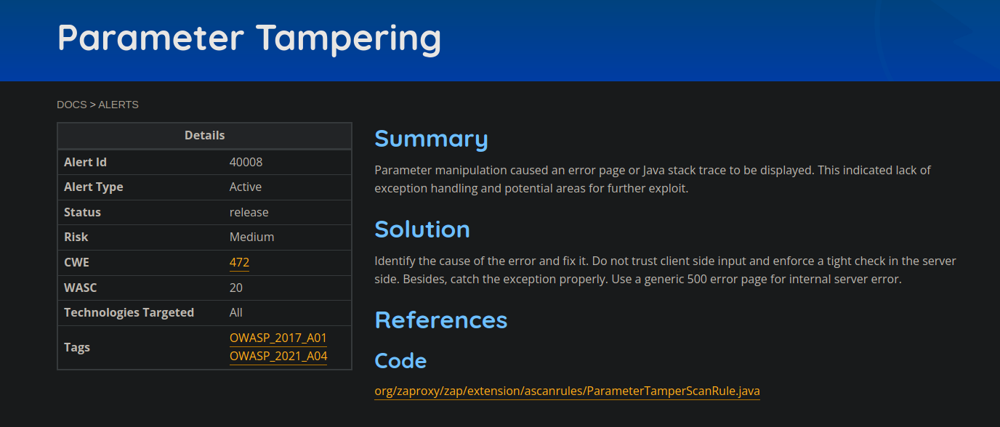

## Projeto: ZAP 

### Issue: [#6119 New common getExampleAlerts() method](https://github.com/zaproxy/zaproxy/issues/6119)

## Descrição da Issue

**Resumo:** O mantenedor do projeto está propondo um novo método a ser implementado em todas as classes de scanner, chamado "getExampleAlerts()". Esse método tem o objetivo de fornecer um alerta de exemplo para ser acessado por um script que irá gerar as páginas de alerta na documentação ([https://www.zaproxy.org/docs/alerts/](https://www.zaproxy.org/docs/alerts/)).

A manipulação de parâmetros fez com que uma página de erro ou rastreio de pilha Java fosse exibido. Isso indicou falta de tratamento de exceção e áreas potenciais para exploração adicional. Deveria adicionar o get examples nessa classe para esse alerta solucionado. O desenvolvimento deve consistir do método e do teste unitário

## O que foi desenvolvido para essa issue?

Eu construí o método de get examples e, para facilitar, também criei um método para criação do alerta, para não ter uma instância do alerta criada repetidas vezes ao longo do código, além de adicionar os testes unitários para isso, a issue também teve que ser um pouco estudada pelo fato do mantenedor solicitar dados reais no exemplo default a ser criado pelo get examples, conclui a issue e a [PR](https://github.com/zaproxy/zap-extensions/pull/4624) foi mergeada com sucesso.

Código do método criado

Código do teste criado

PR mergeada
