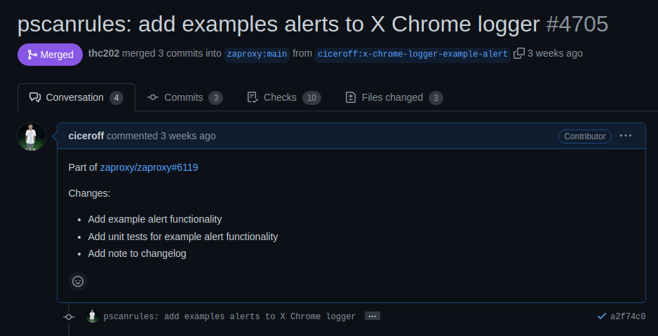
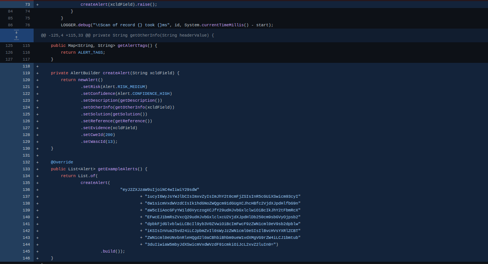
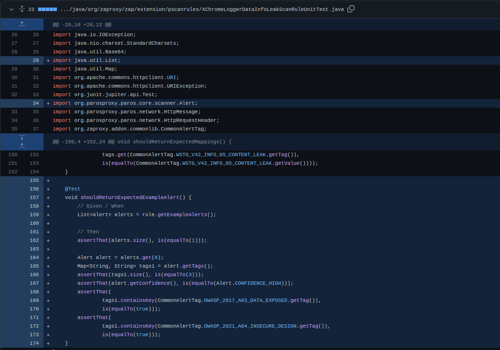

## Projeto: ZAP 

### Issue: [#6119 New common getExampleAlerts() method](https://github.com/zaproxy/zaproxy/issues/6119)

## Descrição da Issue

**Resumo:** O mantenedor do projeto está propondo um novo método a ser implementado em todas as classes de scanner, chamado "getExampleAlerts()". Esse método tem o objetivo de fornecer um alerta de exemplo para ser acessado por um script que irá gerar as páginas de alerta na documentação ([https://www.zaproxy.org/docs/alerts/](https://www.zaproxy.org/docs/alerts/)).

Nessa sprint tentei encontrar outras issues para poder trabalhar, de outros projetos, explorei um pouco do Threat Dragon mas tive problemas na hora de configurar o ambiente, então para o fim da sprint decidi seguir com mais um get examples para não ficar sem contribuição alguma na sprint.

O servidor está vazando informações por meio do header de resposta X-ChromeLogger-Data (ou X-ChromePhp-Data). O conteúdo de tais headers pode ser personalizado pelo desenvolvedor, porém não é incomum encontrar: localizações do sistema de arquivos do servidor, declarações vhost, etc.

Desta vez, por conhecer melhor a issue, foi mais fácil o desenvolvimento e também agora eu entendi melhor do que se trata mesmo, na primeira vez que fiz eu me baseei muito nos outros, agora faz mais sentido para mim o que é desenvolvido. Pode ser encontrado o que foi desenvolvido na [PR](https://github.com/zaproxy/zap-extensions/pull/4705)

PR mergeada

Código da PR

Teste da PR