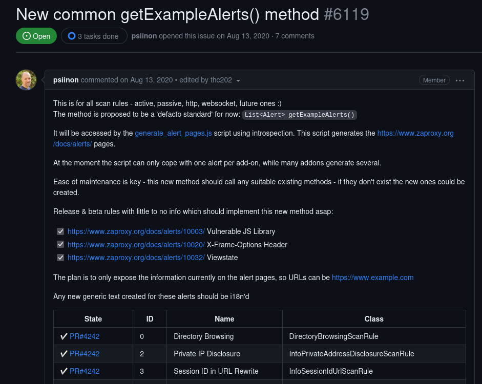

## Projeto: ZAP 

### Issue: [#6119 New common getExampleAlerts() method](https://github.com/zaproxy/zaproxy/issues/6119)

## Descrição da Sprint

**Resumo:** Foi realizado o metodo "getExampleAlerts()" para a classe **HttpOnlySiteScanRule**.

[Pull request relacionado](https://github.com/zaproxy/zap-extensions/pull/4752)
